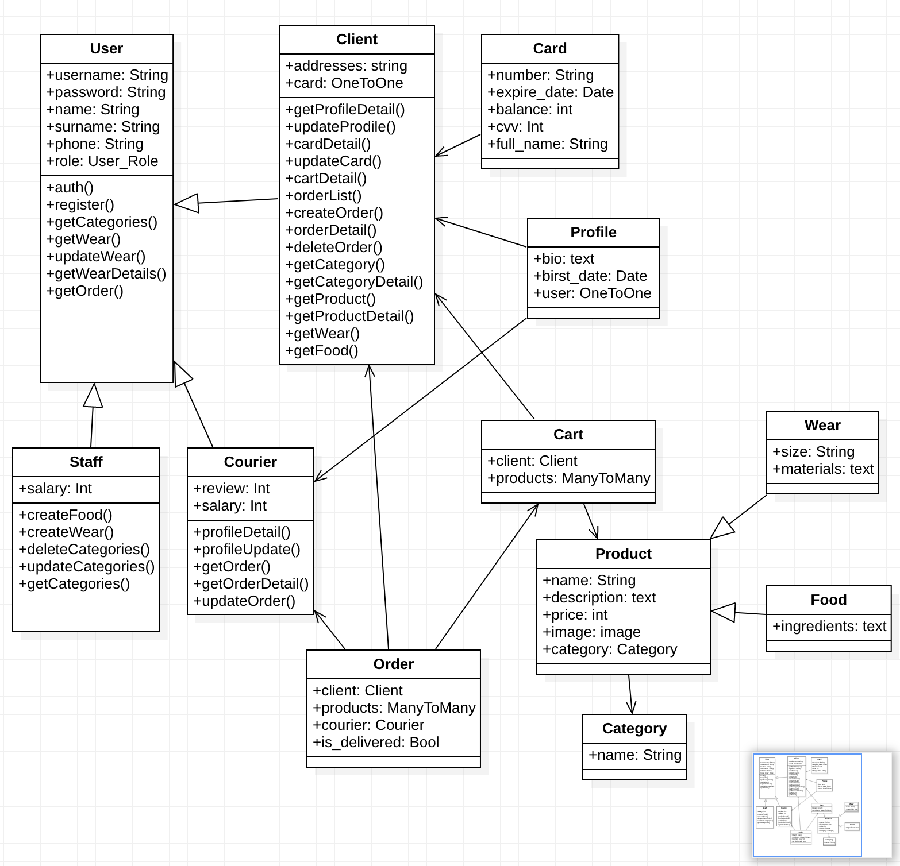
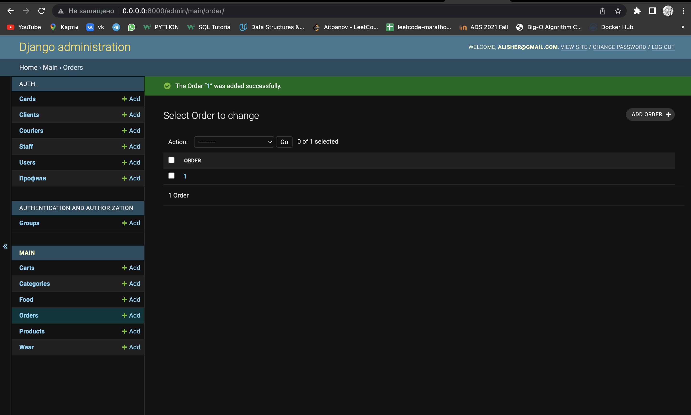
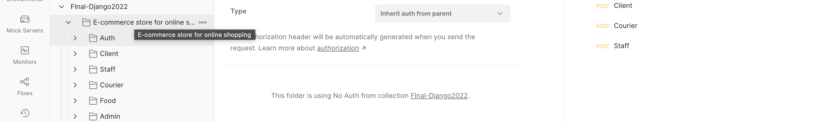

## Done by Abylai Aitbanov 19B030059
## E-commerce store for online shopping

## DB Diagram
<div>
  
</div>


### An E-commerce  online store is a website through which customers  can place orders and individuals buy and sell goods and services over the Internet

### Products are divided by categories, though so users can get the product they want. By creating your account(client) you will have access to your card, cart, profile, and orders that you will purchase.


## Quick Start

#### To get this project up and running locally on your computer:
 1. Clone the repository::
```
  $ git clone https://github.com/AA19BD/Backend-for-high-load.git
  $ cd Backend-for-high-load/project
```

2. Fill the DB connection params:
```
DATABASES = {
    'default': {
        'ENGINE': 'django.db.backends.postgresql_psycopg2',
        'NAME': "",

        'USER': "",

        'PASSWORD': "",

        'HOST': "db",

        'PORT': 5432,
    }
}
```
3. Execute docker container:
```
   $ docker-compose up
```

4. Make migrations in Docker:
```
    docker exec it CONTAINER_ID /bin/bash
    CONTAINER_ID:/code# python3 manage.py makemigrations auth_
    CONTAINER_ID:/code# python3 manage.py migrate auth_
    CONTAINER_ID:/code# python3 manage.py makemigrations
    CONTAINER_ID:/code# python3 manage.py migrate 
```

5. Create superuser in Docker:
```
    docker exec it CONTAINER_ID /bin/bash
    CONTAINER_ID:/code# python3 manage.py createsuperuser
    email: your_email@gmail.com
    password: your_password 
```

6. Open a browser to http://127.0.0.1:8000/admin/ to open the admin site
<div>
  
</div>

7. Create a few test objects of each type 
8. Before testing endpoints login (token)
9. Try use Postman/Swagger to test endpoints
<div>
  
</div>

